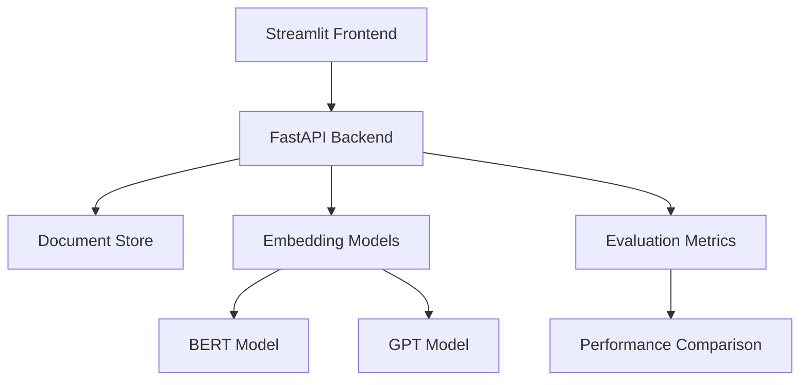
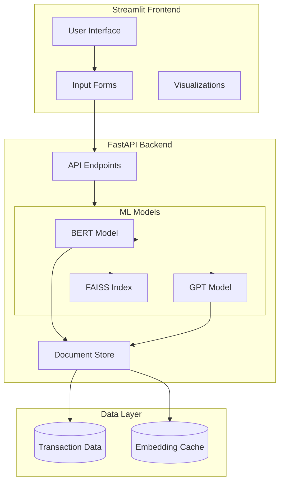
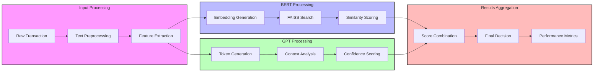
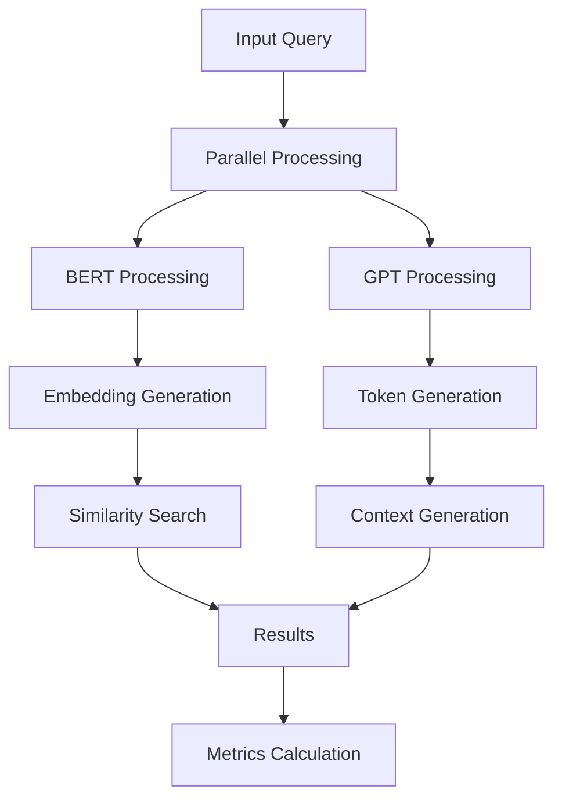
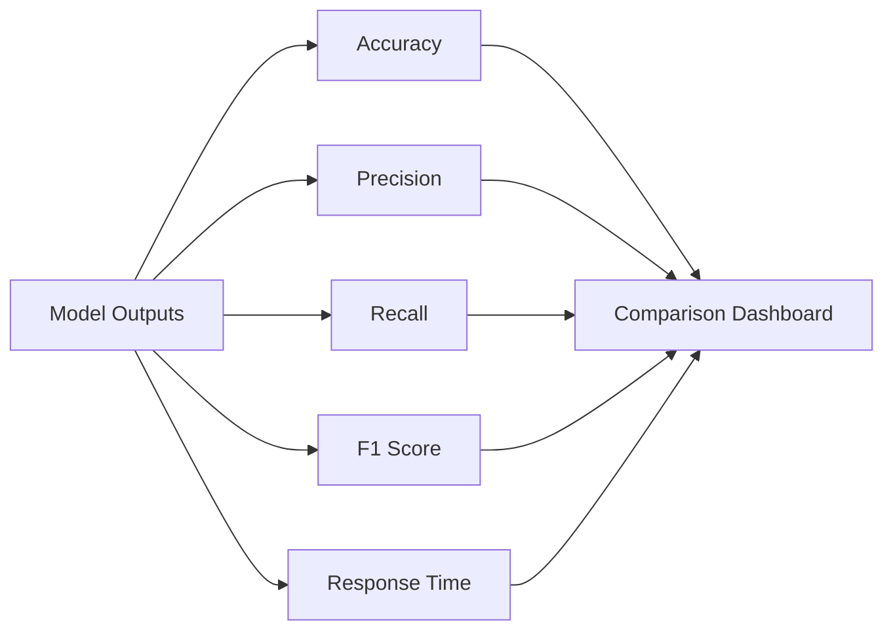

# Fraud Detection RAG System with BERT vs GPT Comparison

This project implements a fraud detection system using RAG (Retrieval Augmented Generation) architecture, comparing the performance of BERT and GPT models. The system includes a Streamlit frontend and FastAPI backend for real-time fraud detection and model comparison.

## Current Progress

✅ Project Structure Created
✅ Synthetic Data Generation Script
✅ FastAPI Backend Implementation
✅ Streamlit Frontend Implementation
✅ Model Integration (BERT and GPT)
✅ Evaluation Metrics
✅ Interactive Dashboard
✅ Model Comparison Features

## Architecture Overview



## System Components

### High-Level Architecture



### Detailed Processing Flow



## Model Comparison Flow



## Evaluation Metrics



## Project Structure

```
fraud-rag/
├── backend/
│   ├── app/
│   │   ├── main.py
│   │   ├── models/
│   │   ├── services/
│   │   └── utils/
│   ├── tests/
│   └── requirements.txt
├── frontend/
│   ├── app.py
│   └── requirements.txt
├── data/
│   ├── generate_fraud_data.py
│   └── sample_fraud_data.json
└── README.md
```

## Features

- Real-time fraud detection using RAG architecture
- Parallel processing with BERT and GPT models
- Comprehensive evaluation metrics
- Interactive Streamlit dashboard
- FastAPI backend with async support
- Document similarity search
- Performance comparison visualization
- Synthetic data generation for testing

## Setup and Installation

1. Clone the repository:
   ```bash
   git clone <repository-url>
   cd fraud-rag
   ```

2. Generate synthetic data:
   ```bash
   cd data
   python generate_fraud_data.py
   cd ..
   ```

3. Install backend dependencies:
   ```bash
   cd backend
   pip install -r requirements.txt
   ```

4. Install frontend dependencies:
   ```bash
   cd frontend
   pip install -r requirements.txt
   ```

5. Run the backend:
   ```bash
   cd backend
   uvicorn app.main:app --reload
   ```

6. Run the frontend:
   ```bash
   cd frontend
   streamlit run app.py
   ```

## API Endpoints

- POST `/api/detect-fraud`: Fraud detection endpoint
- GET `/api/compare-models`: Model comparison endpoint
- GET `/api/metrics`: Performance metrics endpoint

## Model Comparison Metrics

- Accuracy
- Precision
- Recall
- F1 Score
- Response Time
- Context Relevance
- False Positive Rate
- False Negative Rate

## Frontend Features

1. Dashboard
   - Transaction distribution
   - Key metrics visualization
   - Real-time statistics

2. Fraud Detection
   - Transaction input form
   - Real-time analysis
   - Similar transactions display
   - Confidence scores

3. Model Comparison
   - Accuracy comparison
   - Processing time analysis
   - Detailed metrics table
   - Interactive visualizations

## Contributing

Contributions are welcome! Please feel free to submit a Pull Request.

## License

This project is licensed under the MIT License - see the LICENSE file for details. 